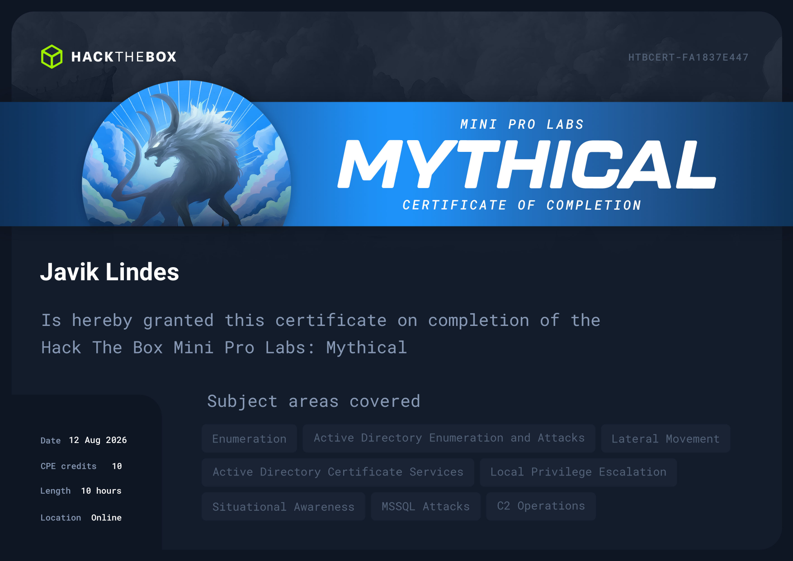
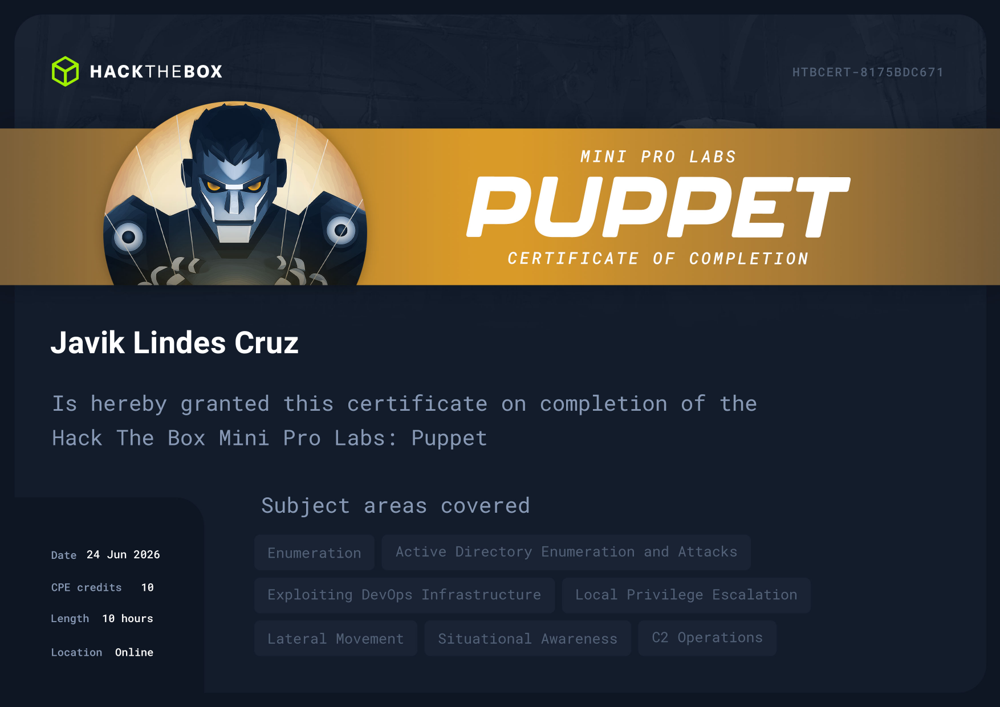

# 🏆 Certificaciones y Laboratorios

Seguimiento de rutas de estudio, acreditaciones profesionales y progreso en entornos empresariales simulados de Hack The Box.

---

## 📜 Certificaciones

Rutas de preparación, metodologías de estudio y seguimiento de certificaciones de seguridad ofensiva.

| Certificación | Emisor | Estado | Enfoque principal |
| :--- | :--- | :--- | :--- |
| <!-- TODO: completar (ej. CPTS, OSCP, eCPPT) --> | <!-- TODO: completar (ej. Hack The Box, OffSec) --> | <!-- TODO: En progreso / Obtenida --> | <!-- TODO: Active Directory, Web, Infraestructura --> |

---

## ⚡ ProLabs (Hack The Box)

Entornos empresariales completos simulados a gran escala para auditorías de Active Directory, pivoting avanzado y post-explotación corporativa.

| ProLab | Dificultad | Tecnologías y Vectores | Progreso |
| :--- | :--- | :--- | :--- |
| <!-- TODO: completar (ej. Dante, Offshore, Zephyr, Cybernetics) --> | <!-- TODO: Media / Difícil / Insane --> | <!-- TODO: AD, Pivoting, Kerberos, Evasión --> | <!-- TODO: % banderas obtenidas --> |

---

## 🧪 Mini ProLabs

Escenarios prácticos focalizados y retos tácticos empresariales completados en Hack The Box.

| Mini ProLab | Plataforma | Estado | Enfoque principal |
| :--- | :--- | :--- | :--- |
| **Mythical** | Hack The Box | :white_check_mark: **Completado (100%)** | Active Directory, Pivoting, C2, Explotación avanzada |
| **Puppet** | Hack The Box | :white_check_mark: **Completado (100%)** | Active Directory, C2, Gestión de identidades, PrivEsc |

### Certificados de Finalización

-   __Mythical — Certificate of Completion__

    ---

    

-   __Puppet — Certificate of Completion__

    ---

    

