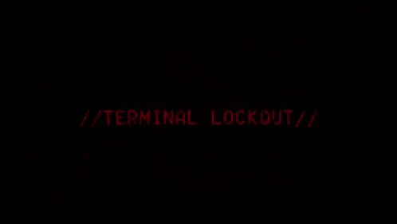

---
hide:
  - toc
---

  

# 🎯 Bitácora de javik

🧠 Hola, soy javik, un chico apasionado por la ciberseguridad y autodidacta. Creé este entorno para poder compartir lo que hago. Me gustan mucho los temas de Active Directory; ¡espero que te guste y la pases bien!

  <h2>Bienvenido a MI BLOG, donde la pasión por la seguridad ofensiva se mezcla con la curiosidad sin límites.</h2>

  

  <a href="maquinas/htb/" class="md-button md-button--primary">💀 Ver Máquinas HTB</a>

## Secciones principales

-   :material-skull:{ .lg .middle } __[Máquinas HTB](maquinas/htb/index.md)__

    ---

    Writeups técnicos y análisis de explotación de máquinas retiradas.

-   :material-tools:{ .lg .middle } __[Herramientas](herramientas/index.md)__

    ---

    Chuletas, scripts y metodologías esenciales para auditorías y pentesting.

-   :material-trophy:{ .lg .middle } __[Certificaciones](certificaciones/index.md)__

    ---

    Certificaciones profesionales, ProLabs y Mini ProLabs de Hack The Box.

-   :material-file-document-outline:{ .lg .middle } __[Mis Notas](mis-notas/index.md)__

    ---

    Espacio personal para apuntes, guías y notas técnicas.

